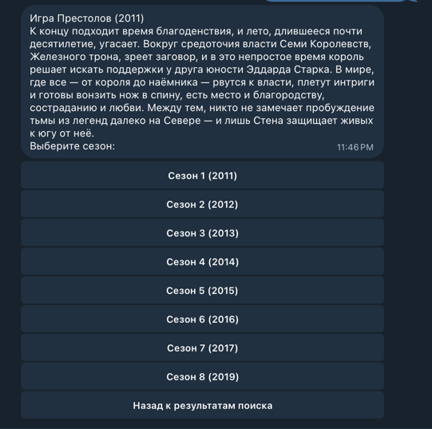
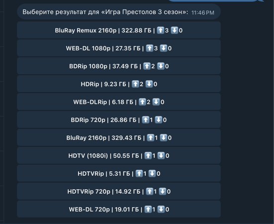
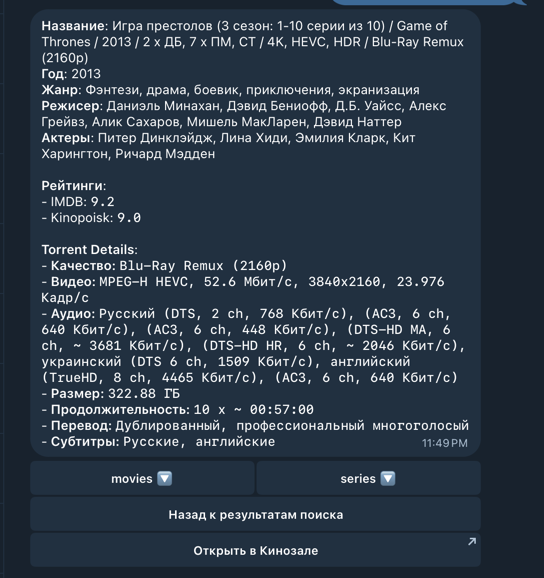
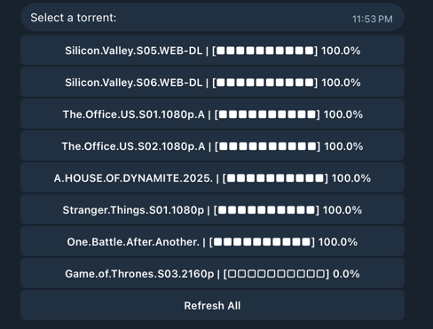
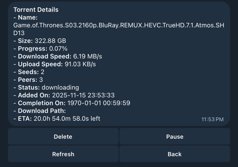
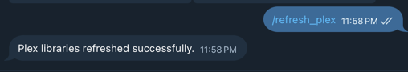

# Kinozal Bot

 <!-- Optional: Add a logo if available -->

A modern Telegram bot for movie enthusiasts! Search, download, and manage torrents seamlessly with integrations for Kinopoisk, TMDB, qBittorrent, and Plex.

## 🚀 What is Kinozal Bot?

Kinozal Bot is your personal movie assistant on Telegram. It allows you to:

- Search for movies using popular databases like Kinopoisk and TMDB.
- Find and download torrents from providers like Kinozal and Rutracker.
- Manage your downloads via qBittorrent (start, pause, delete, check status).
- Automatically refresh your Plex library after downloads.

Built with Python, it's easy to set up and customize for your media server needs.

## ✨ Features

- **Movie Search**: Quickly find movies with details like ratings, cast, and summaries.
- **Smart Torrent Search**: Uses Groq LLMs to intelligently find and select the best torrents for each video quality, prioritizing those with the most seeds.
- **Torrent Management**: Add, pause, resume, delete torrents, and view detailed statuses.
- **Plex Integration**: Trigger library scans to update your media collection.
- **Multi-Source Support**: Pull data from multiple torrent and movie info providers.
- **User-Friendly Interface**: Intuitive Telegram commands and inline keyboards.

## 📸 Screenshots

Here are some examples of how the bot works.


*Searching for a movie and viewing results.*




*Selecting a season to view episodes.*




*Viewing available torrents for a movie.*




*Selecting and downloading a torrent.*





*Viewing torrent statuses and managing downloads.*



*Refreshing the Plex library after a download.*

## 🛠️ Setup

Follow these steps to get Kinozal Bot up and running.

### Prerequisites

- Python 3.10+
- Docker (optional but recommended)
- Telegram Bot Token (from BotFather)
- API keys for Kinopoisk, TMDB, etc.
- qBittorrent and Plex setup

### Installation

1. **Clone the Repository**

   ```bash
   git clone https://github.com/yourusername/kinozal-bot.git
   cd kinozal-bot
   ```

2. **Set Up Environment**

   Copy the example env file and fill in your details:

   ```bash
   cp example.env .env
   ```

   Edit `.env` with your Telegram token, API keys, qBittorrent credentials, etc.

3. **Install Dependencies**

   Using uv (recommended):

   ```bash
   uv sync
   ```

   Or with pip:

   ```bash
   pip install -e .
   ```

4. **Run with Docker**

   ```bash
   docker-compose up -d
   ```

   For qBittorrent-specific compose:

   ```bash
   docker-compose -f docker-compose-qbt.yaml up -d
   ```

## 📖 How to Use

1. **Start the Bot**: Send `/start` to initialize.
2. **Search for Movies**: Use `/search movie_name` or the inline search.
3. **View Details**: Select a movie to see more info.
4. **Download Torrent**: Choose a torrent provider and start downloading.
5. **Manage Torrents**: Use commands like `/status`.
6. **Refresh Plex**: After download, use `/refresh_plex` to update your library.

For more commands, check the bot's help menu with `/help`.

## 🤝 Contributing

Contributions are welcome! Feel free to open issues or submit pull requests.

## 📄 License

This project is licensed under the MIT License - see the [LICENSE](LICENSE) file for details.

---

Built with ❤️ by [Your Name]. If you have questions, reach out on Telegram or GitHub!
