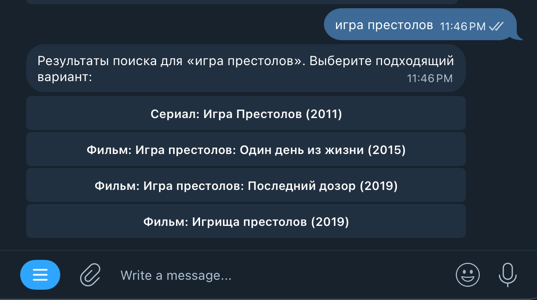
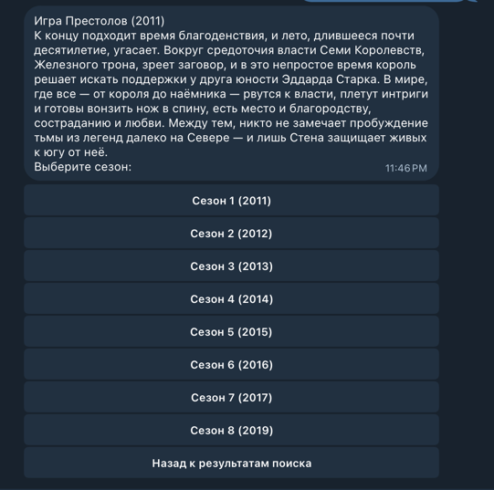
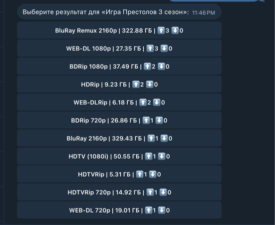
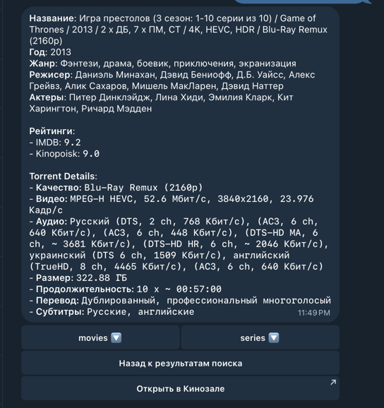
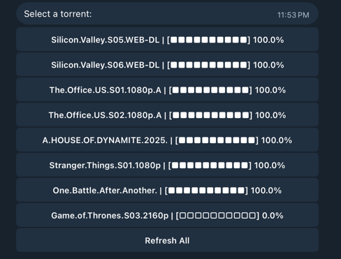
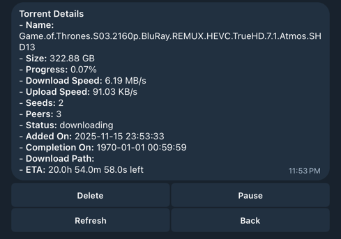

# Kinozal Bot

Telegram bot for searching movies and managing torrents. Searches movies via TMDB/Kinopoisk, downloads torrents from Kinozal/Rutracker, manages downloads through qBittorrent, and refreshes Plex library.

## Features

- Movie and TV series search (TMDB, Kinopoisk)
- Smart torrent selection powered by Groq LLM
- qBittorrent download management (start, pause, delete, status)
- Plex library refresh after downloads
- Two modes: polling (development) and webhook (production)

## Screenshots

| Movie Search | Season Selection | Torrent List |
|:---:|:---:|:---:|
|  |  |  |

| Download | Management | Download Details |
|:---:|:---:|:---:|
|  |  |  |

## Quick Start

### Prerequisites

- Python 3.12+
- [uv](https://docs.astral.sh/uv/) package manager
- Docker and Docker Compose
- Telegram Bot Token ([BotFather](https://t.me/BotFather))
- qBittorrent with Web UI enabled

### 1. Clone the repository

```bash
git clone https://github.com/nidzhat/kinozal-bot.git
cd kinozal-bot
```

### 2. Configure environment variables

```bash
cp example.env .env
```

Open `.env` and fill in the required variables:

| Variable | Description | Required |
|---|---|:---:|
| `TELEGRAM_BOT_TOKEN` | Bot token from BotFather | yes |
| `QBT_HOST` | qBittorrent Web UI address | yes |
| `QBT_PORT` | qBittorrent Web UI port | yes |
| `QBT_USERNAME` | qBittorrent login | yes |
| `QBT_PASSWORD` | qBittorrent password | yes |
| `TMDB_API_TOKEN` | TMDB API token | yes |
| `KINOZAL_USERNAME` / `KINOZAL_PASSWORD` | Kinozal credentials | if `USE_KINOZAL=1` |
| `RUTRACKER_USERNAME` / `RUTRACKER_PASSWORD` | Rutracker credentials | if `USE_RUTRACKER=1` |
| `GROQ_API_KEY` | Groq API key for smart torrent selection | no |
| `KINOPOISK_API_KEY` | Kinopoisk API key | if `SEARCH_PROVIDER=kinopoisk` |
| `PLEX_URL` / `PLEX_TOKEN` | Plex for library refresh | no |

### 3. Run locally

```bash
uv sync
uv run uvicorn src.bot.main:app --reload --host 0.0.0.0 --port 8000
```

Make sure `USE_POLLING=true` is set in `.env` for local development.

### 4. Run qBittorrent (if you don't have one)

```bash
docker compose -f docker-compose-qbt.yaml up -d
```

## Production

### Docker Compose

```bash
docker compose up -d --build
```

The bot is built from the Dockerfile and runs alongside Redis.

### Secrets via Infisical

In production, environment variables are fetched via [Infisical](https://infisical.com/) at container startup. Fill these in the `.env` on the server:

```
INFISICAL_TOKEN=<machine identity token>
PROJECT_ID=<infisical project id>
INFISICAL_ENV=prod
```

All other secrets are stored in Infisical and injected automatically via `infisical run`.

### CI/CD

On push to `master`, GitHub Actions automatically:
1. Copies project files to the server via SCP
2. Builds the Docker image and restarts the container

## Bot Commands

| Command | Description |
|---|---|
| `/start` | Start the bot |
| `/search <title>` | Search for a movie or TV series |
| `/status` | Check current download status |
| `/refresh_plex` | Refresh Plex library |
| `/help` | Show available commands |

## Tech Stack

- **Python 3.12**, **FastAPI**, **Aiogram 3**
- **Redis** — caching
- **qBittorrent** — torrent management
- **Groq LLM** — smart torrent selection
- **TMDB / Kinopoisk** — movie search
- **Plex** — media server
- **Infisical** — secrets management
- **Docker Compose** — deployment
